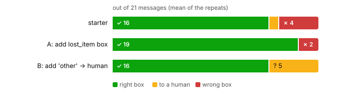
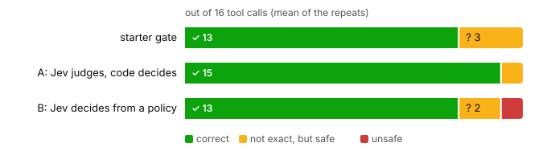
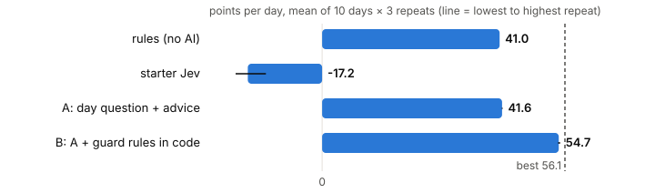
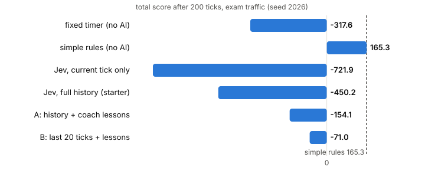
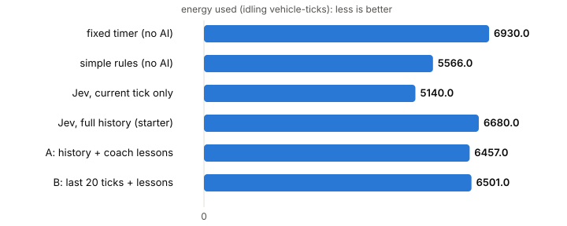

# Real results: every solution, measured

Measured with the **real Jev API** (`jev-latest`) on 2026-10-02, through the workshop proxy. 2,617 calls in total, **US$0.29**. Made by `results/run_all.py`, drawn by `results/report.py`. Run them again to check (or after a new Jev version).

| Level | Starter | Solution A | Solution B | Best idea |
|---|---|---|---|---|
| 1 | naive question | one question + criteria | three small questions | spam is easy: work on the threshold |
| 2 | misroutes lost items | add the missing box | add `other` → human | a missing box = silent mistakes |
| 3 | asks for small refunds | Jev judges, code decides | Jev decides from a policy | keep the rules in code |
| 4 | loses to if/else | better words | better words + guard rules | ask for the whole day; guard rules |
| 5 | reads all history, rarely walks | history + coach lessons | last 20 ticks + lessons | digest the history into lessons |

## Level 1 · spam filter (noul)

Accuracy on the 6 workshop messages and on 20 new messages the solutions never saw (`results/test_sets.py`). Mean over the repeats; false alarms = good messages marked spam.

| Approach | Workshop (6) | New messages (20) | False alarms | Missed spam |
|---|---|---|---|---|
| naive question | 100% | 100% | 0 in 3 runs | 0 in 3 runs |
| A: one question + criteria | 100% | 100% | 0 in 3 runs | 0 in 3 runs |
| B: three small questions | 100% | 98% | 1 in 3 runs | 0 in 3 runs |

**What we learned:** spam is easy for Jev. Even the naive question was right every time. So in the workshop, spend the time on the *threshold* (what is worse: a false alarm or a miss?) and on Solution B's bonus: it says *why* (`prize_or_money 0.97`). Solution B made one false alarm in one run: three questions = three chances to say yes.

<sub>Level 1: 234 calls, 76,980 input tokens, US$0.0032, 62 s.</sub>

## Level 2 · inbox sorter (choice + score + confidence)

21 messages: the 7 workshop messages + 14 new ones, including lost items and messages that fit no box.



| Approach | Right box | Sent to a human | Wrong box (silent mistake) |
|---|---|---|---|
| starter | 16 | 1 | 4 |
| A: add lost_item box | 19 | 0 | 2 |
| B: add 'other' -> human | 16 | 5 | 0 |

**What we learned:** the starter's confidence check did not catch the lost-item messages: Jev was *confident* they were questions. A missing box is a silent mistake. **A** (add the box) gets more right; **B** (add `other` → human) makes **zero** silent mistakes, at the price of more work for people. Pick by what a mistake costs you.

<sub>Level 2: 189 calls, 88,425 input tokens, US$0.0037, 28 s.</sub>

## Level 3 · agent safety gate (many questions, one call)

16 tool calls: the 5 workshop calls + the red-team call + 10 new ones, each labelled ALLOW / ASK_HUMAN / BLOCK. "Unsafe" = the gate said ALLOW where the label says ASK_HUMAN or BLOCK. "Not exact, but safe" = for example ASK_HUMAN where the label says BLOCK: a person still checks it.



| Approach | Correct decision | Not exact, but safe | Unsafe (ALLOWED a call that needed a human or a block) |
|---|---|---|---|
| starter gate | 13 | 3 | 0 |
| A: Jev judges, code decides | 15 | 1 | 0 |
| B: Jev decides from a policy | 13 | 2 | 1 |
| ↳ unsafe ones | `line.group_message` (ASK_HUMAN → ALLOW) | | |

**What we learned:** **A** (Jev judges, code decides) was the most accurate and never unsafe. **B** (Jev decides from a written policy) is shorter code, but it allowed a message to the staff group without asking: rules in text are softer than rules in code. Numbers (the NT$200 limit) belong in code.

<sub>Level 3: 144 calls, 77,976 input tokens, US$0.0033, 22 s.</sub>

## Level 4 · tea shop (decisions in a loop)

10 different days (seeds 1–10; the workshop uses 1–3), 3 repeats each. "Best possible" comes from trying every plan (`level4-tea-shop/best_possible.py`).



| Approach | Mean, 10 days | Workshop days 1 / 2 / 3 | % of best possible |
|---|---|---|---|
| rules (no AI) | 41.0 | 47 / 30 / 41 | 73% |
| starter Jev | -17.2 | 7 / -30 / -14 | -31% |
| A: day question + advice | 41.6 | 51 / 45 / 36 | 74% |
| B: A + guard rules in code | 54.7 | 66 / 60 / 51 | 97% |
| best possible | 56.1 | 72 / 60 / 51 | 100% |

**What we learned:** the starter Jev loses to plain if/else rules (41) because the question says "this round" and Jev answers exactly that. **A** only changes words (ask for the whole day, describe the rush) and ties the rules. **B** adds easy guard rules in code and reaches 97% of the best possible. The repeats hardly move: in this small game Jev's answers are stable.

<sub>Level 4: 1290 calls, 733,244 input tokens, US$0.0308, 224 s.</sub>

## Level 5 · Jev runs three traffic lights as one smart state machine

One stream of 200 ticks on Zhongxiao E. Rd (Fuxing, Dunhua, Guangfu), the exam traffic (seed 2026). Every tick Jev reads the history so far: what each junction saw (6 cells down each road), the decisions, the points and the energy of every past tick, and the totals. 1 run(s) per Jev officer: each run is about 190 calls, so we keep it small.





| Officer | Score | Energy | Points per 50 ticks | Walks | People waiting at the end | Input tokens per run |
|---|---|---|---|---|---|---|
| fixed timer (no AI) | -318 | 6,930 | -57 / -158 / -18 / -85 | 45 | 5 | no AI |
| simple rules (no AI) | 165 | 5,566 | 25 / 69 / 51 / 20 | 32 | 12 | no AI |
| Jev, current tick only | -722 | 5,140 | -58 / -481 / -119 / -64 | 15 | 20 | 0.23M |
| Jev, full history (starter) | -450 | 6,680 | -32 / -104 / -181 / -133 | 18 | 3 | 2.61M |
| A: history + coach lessons | -154 | 6,457 | -88 / -69 / -16 / 20 | 44 | 16 | 2.52M |
| B: last 20 ticks + lessons | -71 | 6,501 | -58 / 5 / 1 / -20 | 54 | 7 | 0.66M |

**What we learned:**

- **Raw history helped only a little** (current tick only -722, full history -450). Jev still rarely chose walk, and waiting pedestrians cost the most points. The cause is in the history (the `p` numbers grow, the points sink), but Jev answers one question at a time: it does not work out "my points fall BECAUSE nobody walked" from 200 lines of log. And the full history costs about 11x the tokens.
- **Digested history works much better.** With the coach's LESSONS ("in moments like this, walk was +0.8 better") Jev walks about 3 times as often and scores far higher. Solution A's points per 50 ticks rise during the stream: that is learning, inside one stream.
- **A short history plus lessons was the best Jev, for a quarter of the tokens** (solution B).
- **The simple rules are still the best.** Three good if/else rules are a strong opponent. Beat them!
- **One run each, and runs differ a lot.** While building this level the same set-ups scored: current tick only -1,187, full history -2,387, A -88, B -369. Jev's answers jitter a little and one changed light changes the rest of the stream. Compare on the exam seed, and repeat when you can.

<sub>Level 5: 760 calls, 6,021,364 input tokens, US$0.2529, 146 s.</sub>

## How to repeat this

```bash
cd workshop
export JEV_BASE_URL=https://your-proxy.example.com JEV_API_KEY=jvp_... JEV_MOCK=0
python results/run_all.py --repeats 3    # about US$0.30
python results/report.py
```
